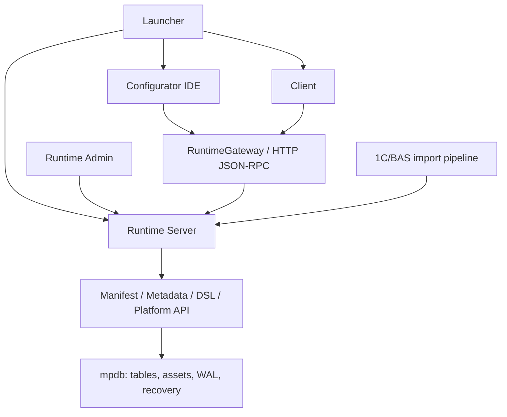

# MetaPlatform

> **Desktop-first платформа та IDE для розробки metadata-driven бізнес-застосунків.**  
> Product UI and DSL: **Ukrainian (`uk`) / English (`en`)**.

MetaPlatform об'єднує власне файлове сховище `mpdb`, Runtime-сервер, Configurator IDE, клієнтський застосунок, внутрішню мову модулів, редактор форм і засоби імпорту структури 1C/BAS.

Мета проєкту — описувати структуру, форми та поведінку прикладного рішення у Configurator, зберігати їх у єдиній metadata-моделі та відтворювати готову конфігурацію у Client через централізований Runtime.

> [!WARNING]
> Проєкт перебуває на стадії активної розробки (`experimental / pre-release`). Це не готова заміна 1C/BAS і не production-ready платформа. Формат зберігання, API, DSL, сумісність та UX ще можуть змінюватися.

## OpenAI Build Week 2026

MetaPlatform існувала до початку OpenAI Build Week, однак під час хакатону проєкт був суттєво розширений за допомогою OpenAI Codex і GPT-5.6.

Основними напрямами роботи під час Build Week стали:

- пряме читання структури `.1CD`;
- перетворення metadata 1C/BAS у внутрішню модель MetaPlatform;
- відновлення документів, реквізитів, табличних частин та пов'язаних metadata-об'єктів;
- прискорення точкового доступу до об'єктів через B-tree та row locator у `mpdb`;
- перенесення live-доступу до робочої бази за межі UI у Runtime RPC;
- створення Runtime-owned Workspace Semantic Index;
- фоновий прогрів семантичного індексу без блокування відкриття бази;
- Runtime-backed completion і навігація між модулями;
- семантичний пошук використань без помилкових збігів у коментарях і рядках;
- локальне та конфігураційне перейменування символів;
- staged-імпорт за схемою `backup -> staging -> validate -> swap`;
- автоматизована перевірка Configurator через Control API;
- оптимізація імпорту великих конфігурацій і оновлення дерева metadata;
- розширення regression, unit, integration та Qt-тестів.

### Що існувало до Build Week

До початку хакатону MetaPlatform вже містила:

- ранню реалізацію файлового рушія `mpdb`;
- базовий каркас Configurator;
- дерево metadata-об'єктів;
- експериментальний редактор форм;
- прототип Client;
- початкову реалізацію внутрішньої DSL;
- експериментальні механізми XML та 1C/BAS-імпорту.

### Як використовувався Codex

Codex з GPT-5.6 використовувався для:

- аналізу великої кодової бази;
- трасування архітектурних залежностей;
- планування змін;
- реалізації та рефакторингу Runtime і Configurator;
- налагодження прямого `.1CD`-імпорту;
- пошуку помилок у storage та indexed access;
- профілювання повільних операцій;
- створення й покращення автоматизованих тестів;
- перевірки архітектурних інваріантів;
- пошуку регресій;
- документування реалізованих змін і технічних рішень.

Усі продуктові рішення, архітектурні зміни, приймання реалізації та фінальна перевірка виконувалися автором проєкту.

### Build evidence

- Author: **Roman Tishkov**
- Hackathon commit range: `[FIRST BUILD WEEK COMMIT]` → `[FINAL SUBMISSION COMMIT]`
- Codex feedback session ID: `[CODEX SESSION ID]`
- Demo video: `[YOUTUBE VIDEO URL]`
- Implementation log: [`src/docs/O_PRODELANNOI_RABOTE.md`](src/docs/O_PRODELANNOI_RABOTE.md)
- Architecture: [`ARCHITECTURE.md`](ARCHITECTURE.md)

## Навіщо MetaPlatform

Бізнес-застосунки часто жорстко прив'язані до legacy-платформ, закритих runtime-середовищ і складних форматів конфігурацій.

Перенесення таких систем зазвичай вимагає вручну відтворювати:

- довідники;
- документи;
- регістри;
- звіти;
- форми;
- правила перевірки;
- бізнес-логіку;
- права доступу;
- інтерфейс користувача.

MetaPlatform досліджує інший підхід: прикладне рішення описується єдиною metadata-моделлю, а Runtime використовує цю модель для збереження, редагування та виконання бізнес-застосунку.

Імпорт 1C/BAS використовується як міст для аналізу й перенесення наявних рішень, а не як архітектурна основа платформи.

## Основні принципи

- конфігурація описується metadata-об'єктами з GUID;
- Manifest у `mpdb` є джерелом істини для структури конфігурації;
- Configurator і Client працюють із live-базою через Runtime RPC;
- форми, модулі та assets зберігаються разом із конфігурацією;
- українська й англійська мови є штатними мовами UI та DSL;
- Runtime є єдиним власником live-доступу до робочої бази;
- імпорт виконується через staging і валідацію перед заміною активної бази.

## Поточні можливості

### Configurator IDE

- дерево конфігурації та metadata-об'єктів;
- редактори довідників, документів, звітів, обробок та інших типів metadata;
- редактор форм із деревом елементів;
- реквізити, параметри, команди та runtime-preview форм;
- редактор модулів із підсвічуванням синтаксису;
- локальний і Runtime-backed completion;
- діагностика та навігація по вихідному коду;
- completion експортних процедур і функцій після імені загального модуля;
- `F12` і `Ctrl+Click` для переходу до визначення;
- `Shift+F12` для семантичного пошуку використань;
- `Shift+F6` для перейменування символу в межах модуля;
- `Ctrl+Shift+F6` для preview та атомарного перейменування експортного символу в конфігурації;
- точки зупинки;
- покрокове виконання;
- call stack;
- locals і globals;
- обчислення debug-виразів;
- стартові, загальні, об'єктні та формові модулі;
- фоновий Configurator Control API для автоматизованої перевірки.

### Runtime

- локальний HTTP/JSON-RPC сервер;
- сесії та централізоване відкриття live-баз;
- операції з Manifest, таблицями, модулями та assets;
- реєстр доступних баз;
- кеш структури;
- кеш текстів модулів;
- Runtime-owned Workspace Semantic Index;
- фоновий прогрів семантичного індексу;
- Runtime-сервіси для форм, звітів, друку та проведення;
- staged-імпорт за схемою `backup -> staging -> validate -> swap`;
- CLI та Qt-інструменти адміністрування.

### Client

- окремий Qt-застосунок для роботи користувача;
- навігація за підсистемами та metadata-об'єктами;
- завантаження структури через Runtime;
- побудова форм зі збереженої моделі;
- виконання стартових і прикладних модулів;
- контекстні дії полів;
- таблиці;
- команди;
- стандартні реквізити.

### Storage і tooling

- власний файловий рушій `mpdb`;
- Manifest metadata;
- таблиці та assets;
- allocator сторінок;
- B-tree-based access;
- row locators;
- WAL і recovery;
- CRC сторінок;
- підтримка стиснення;
- високорівневий `mp_platform` API;
- lexer, parser, validator, compiler, VM і debugger внутрішньої DSL;
- імпорт metadata з XML;
- пряме читання `.1CD`;
- self-check;
- unit, integration та Qt-тести.

## Архітектура



Штатний шлях доступу до даних:

```text
Configurator / Client
        -> RuntimeGateway
        -> Runtime RPC
        -> mpdb
```

Runtime є єдиним власником live-доступу до робочої бази. UI не повинен паралельно відкривати production або local `mpdb` напряму.

Structure cache прискорює запуск, але не замінює Manifest як джерело істини.

Докладніше: [`ARCHITECTURE.md`](ARCHITECTURE.md).

## Judge Quick Start

MetaPlatform наразі запускається з вихідного коду.

Готовий installer і повністю відтворюваний packaged release ще перебувають у розробці.

### Перевірене середовище

- Windows 10/11;
- Python 3.13;
- PowerShell;
- PySide6.

Поточне локальне середовище перевірено на Python 3.13.11.

### 1. Клонування репозиторію

```powershell
git clone https://github.com/EritikWoW/MetaPlatform.git
Set-Location MetaPlatform
```

### 2. Створення віртуального середовища

```powershell
py -3.13 -m venv .venv
.\.venv\Scripts\Activate.ps1
```

Якщо PowerShell блокує активацію:

```powershell
Set-ExecutionPolicy -ExecutionPolicy RemoteSigned -Scope CurrentUser
```

Після цього повторно активуйте `.venv`.

### 3. Встановлення залежностей

```powershell
python -m pip install --upgrade pip
python -m pip install PySide6 pytest zstandard Pillow openpyxl pywin32
```

### 4. Перевірка середовища

```powershell
python -m src.scripts.selfcheck
```

### 5. Запуск MetaPlatform

```powershell
python -m src.scripts.run_launcher_qt
```

Launcher дозволяє:

- створити локальну `.mpdb`;
- додати наявну `.mpdb`;
- додати віддалену базу за Runtime URL і GUID;
- автоматично запустити локальний Runtime;
- відкрити Configurator;
- відкрити Client.

## Рекомендований demo flow

1. Запустіть Launcher.
2. Створіть або додайте локальну `.mpdb`.
3. Відкрийте базу у Configurator.
4. Перегляньте дерево metadata.
5. Відкрийте документ, його реквізити та табличні частини.
6. Відкрийте модуль і перевірте completion.
7. Використайте `F12` для переходу до визначення.
8. Використайте `Shift+F12` для пошуку використань.
9. Відкрийте редактор форми та runtime-preview.
10. Запустіть Client для тієї самої бази.

Для додаткової демонстрації можна відкрити локальну `.1CD`, яку користувач має право аналізувати та обробляти.

## Ручний запуск компонентів

### Launcher

```powershell
python -m src.scripts.run_launcher_qt
```

Запуск Configurator у процесі Launcher для UI debugging:

```powershell
python -m src.scripts.run_launcher_qt --debug-ui
```

### Runtime Server

```powershell
python -m src.scripts.run_runtime_server_cmd --host 127.0.0.1 --port 8765
```

Runtime за замовчуванням слухає:

```text
http://127.0.0.1:8765
```

### Реєстрація `.mpdb`

```powershell
python -m src.scripts.run_runtime_admin add "C:\Data\Demo\metabase.mpdb" --name Demo
python -m src.scripts.run_runtime_admin list
```

Команда `add` повертає GUID бази.

Реєстр також підтримує:

- `remove`;
- `enable`;
- `disable`.

### Runtime Admin UI

```powershell
python -m src.scripts.run_runtime_admin_qt
```

### Configurator

```powershell
python -m src.configurator.configurator_app `
  --runtime http://127.0.0.1:8765 `
  --db-uid <database-guid> `
  --db-path "C:\Data\Demo\metabase.mpdb"
```

`--db-path` може містити шлях до локальної `.mpdb` або підтриманої `.1CD`, яку Runtime повинен відкрити.

Configurator також підтримує змінні середовища:

```text
META_RUNTIME_URL
META_DB_UID
META_DB_PATH
```

Configurator Control API за замовчуванням використовує:

```text
127.0.0.1:8766
```

Адресу можна змінити параметрами:

```text
--control-api-host
--control-api-port
```

### Client

```powershell
python -m src.client.client_app `
  --runtime http://127.0.0.1:8765 `
  --db-uid <database-guid>
```

Client потребує:

- URL Runtime;
- GUID відкритої або зареєстрованої бази.

Також підтримуються:

```text
META_RUNTIME_URL
META_DB_UID
```

## Перевірка

### Regression self-check

```powershell
python -m src.scripts.selfcheck
```

Self-check перевіряє базові:

- Manifest policies;
- SVG pipeline;
- debugger smoke scenarios.

### Повний тестовий набір

```powershell
python -m pytest -q src/tests
```

Набір тестів містить перевірки:

- storage;
- WAL і recovery;
- Runtime;
- importer;
- DSL;
- Configurator;
- Client;
- Qt-компонентів;
- integration scenarios.

### Перевірка компіляції Python-модулів

```powershell
python -m compileall -q src
```

## Структура репозиторію

```text
MetaPlatform/
|-- src/
|   |-- mpdb/           # файловий storage engine, WAL і recovery
|   |-- runtime/        # HTTP/JSON-RPC сервер та Runtime services
|   |-- configurator/   # Configurator IDE
|   |-- client/         # Client і Runtime forms
|   |-- ui_qt/          # спільний Qt UI, Launcher, themes та widgets
|   |-- dsl/            # lexer, parser, validator, compiler, VM і debugger
|   |-- infra/onec/     # читання і трансформація 1C/BAS
|   |-- mp_platform/    # високорівневий platform API
|   |-- scripts/        # entry points, self-check та audit tools
|   |-- tools/          # службові CLI-інструменти
|   |-- tests/          # автоматизовані тести
|   `-- docs/           # технічна документація та журнал реалізації
|-- AGENTS.md           # правила роботи з репозиторієм
|-- ARCHITECTURE.md     # архітектурний опис
|-- pyproject.toml      # поточна конфігурація проєкту і pytest
`-- README.md
```

## Мови

Штатні локалі продукту:

- Ukrainian (`uk`);
- English (`en`).

Імпортований код 1C/BAS може містити російські ідентифікатори та сумісний синтаксис, але російська локаль не є цільовою UI-локаллю MetaPlatform.

## Статус зрілості

| Область | Поточний статус |
|---|---|
| `mpdb`, WAL/recovery | Реалізовано, активно тестується |
| Runtime RPC і реєстр БД | Реалізовано, API ще не стабілізовано |
| Configurator IDE | Активна розробка |
| Редактор форм і runtime-preview | Працює для підтриманих моделей |
| DSL, compiler, VM і debugger | Працюючий experimental toolchain |
| Client | Відтворює підтриману metadata/form-модель |
| XML import | Підтримується |
| Direct `.1CD` import | Підтримує значну частину metadata-структури |
| Packaging | Не готово |
| Installer | Не готово |
| Stable public API | Відсутній |

## Відомі обмеження

- Немає стабільного публічного API.
- Не гарантується backward compatibility.
- Немає dependency lock.
- Немає відтворюваного packaged release.
- Немає installer.
- Імпорт 1C/BAS не означає повної бінарної, мовної або поведінкової сумісності.
- Не всі формати форм і metadata-об'єктів підтримані однаково.
- DSL і VM реалізують лише підтриману підмножину прикладної логіки.
- Локальне семантичне перейменування працює в межах одного module asset.
- Cross-module rename наразі підтримує експортні процедури та функції з точними кваліфікованими викликами.
- Частина історичного коду все ще переходить від direct DB access до Runtime RPC.
- Runtime Control API і Configurator Control API призначені передусім для локальної розробки та автоматизованої перевірки.
- Linux і macOS не входять до фактично перевіреної desktop-матриці.

## Безпека та робота з даними

MetaPlatform може обробляти локальні бази бізнес-застосунків і metadata.

Користувач відповідає за:

- використання лише тих баз, до яких він має законний доступ;
- захист конфіденційної бізнес-інформації;
- недопущення публікації реальних клієнтських баз;
- видалення персональних даних і credentials із demo-матеріалів;
- створення резервних копій перед імпортом або модифікацією баз.

Staged-імпорт знижує ризик пошкодження активної бази MetaPlatform, але проєкт залишається експериментальним.

## Документація

- [`ARCHITECTURE.md`](ARCHITECTURE.md) — фактична й цільова архітектура;
- [`AGENTS.md`](AGENTS.md) — інваріанти та правила роботи з кодовою базою;
- [`src/docs/O_PRODELANNOI_RABOTE.md`](src/docs/O_PRODELANNOI_RABOTE.md) — журнал реалізованих змін, перевірок і прийнятих рішень.

## Участь у розробці

Перед зміною архітектурного контуру:

1. Звірте фактичний код із `ARCHITECTURE.md`.
2. Перевірте інваріанти у `src/docs/O_PRODELANNOI_RABOTE.md`.
3. Не відкривайте live `mpdb` паралельно з UI в обхід Runtime.
4. Додайте або оновіть тести.
5. Виконайте `selfcheck`.
6. Виконайте відповідний `pytest` gate.
7. Задокументуйте значні архітектурні рішення.

## Roadmap

- dependency management і lock-файл;
- packaged Windows build;
- installer;
- стабільний release profile;
- Runtime API versioning;
- розширення покриття metadata-імпорту;
- підтримка більшої кількості форматів форм;
- розвиток Client;
- розширення cross-module semantic analysis;
- покращення debugger;
- додаткові migration tools;
- дослідження сумісності з Linux і macOS;
- приклади конфігурацій і документація.

## Автор

**Roman Tishkov**

MetaPlatform — незалежний експериментальний проєкт, присвячений metadata-driven розробці бізнес-застосунків, міграції legacy-конфігурацій і Runtime-based виконанню прикладних рішень.

## Ліцензія

До репозиторію необхідно додати окремий файл `LICENSE`.

Рекомендовані варіанти:

- **Apache License 2.0** — permissive open-source ліцензія з явними patent clauses;
- **MIT License** — коротка permissive open-source ліцензія;
- власна proprietary license — якщо зовнішнє використання та поширення мають бути обмежені.

До публікації `LICENSE` дозвіл на зовнішнє використання, модифікацію або поширення коду не надається.
