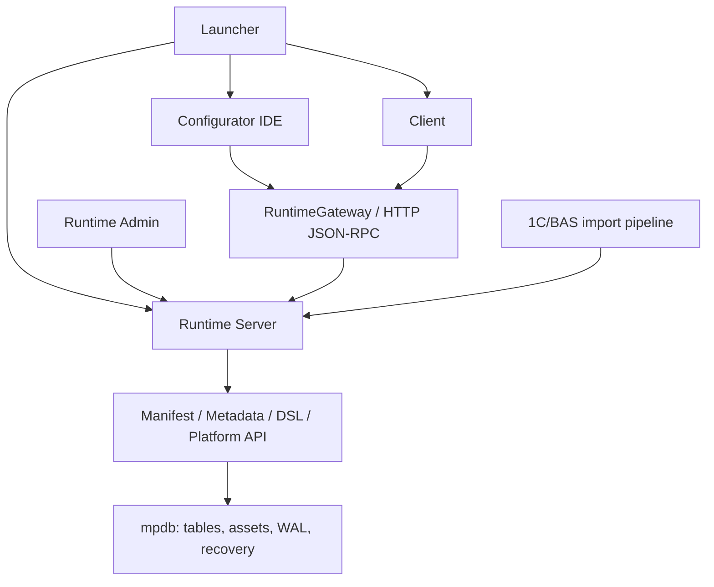

# MetaPlatform

> **Desktop-first платформа та IDE для розробки metadata-driven бізнес-застосунків.**<br>
> Product UI and DSL: **Ukrainian (`uk`) / English (`en`)**.

MetaPlatform об'єднує власне файлове сховище `mpdb`, Runtime-сервер, Configurator IDE, клієнтський застосунок, мову модулів і засоби імпорту структури 1C/BAS. Мета проєкту - описувати структуру, форми та поведінку прикладного рішення у Configurator і відтворювати збережену конфігурацію у Client через єдиний Runtime.

> [!WARNING]
> Проєкт перебуває на стадії активної розробки (`experimental / pre-release`). Це не готова заміна 1C/BAS і не production-ready платформа. Формат, API, DSL та UX ще можуть змінюватися.

## Навіщо MetaPlatform

MetaPlatform розвивається як самостійне середовище розробки бізнес-застосунків, а не як оболонка над зовнішньою СУБД:

- конфігурація описується metadata-об'єктами з GUID;
- Manifest у `mpdb` є джерелом істини для структури конфігурації;
- Configurator і Client звертаються до live-бази через Runtime RPC;
- форми та модулі зберігаються разом із конфігурацією;
- українська й англійська локалі є штатними мовами UI та DSL;
- імпорт 1C/BAS використовується як міст для перенесення структури, а не як архітектурна основа платформи.

## Поточні можливості

### Configurator IDE

- дерево конфігурації та metadata-об'єктів;
- редактори довідників, документів, звітів, обробок та інших типів метаданих;
- редактор форм з деревом елементів, реквізитами, командами, параметрами та runtime-preview;
- редактор модулів з підсвічуванням, локальним і Runtime-backed completion, діагностикою та навігацією;
- completion експортних процедур і функцій після імені загального модуля без завантаження його вихідного тексту в активний редактор;
- `F12` / `Ctrl+Click` для точкового переходу до визначення через Runtime без завантаження чужого модуля в UI;
- `Shift+F12` для семантичного пошуку використань, що виключає коментарі та рядкові літерали;
- `Shift+F6` для семантичного перейменування символів у межах одного модуля;
- `Ctrl+Shift+F6` для preview та атомарного перейменування експортної процедури або функції у всій конфігурації;
- точки зупинки, покрокове виконання, call stack, locals/globals та обчислення debug-виразів;
- робота зі стартовими, загальними й формовими модулями;
- фоновий Control API для автоматизованої перевірки Configurator.

### Runtime

- локальний HTTP/JSON-RPC сервер;
- сесії та централізоване відкриття live-баз;
- операції з Manifest, таблицями, модулями та assets;
- кеш структури, текстів модулів і Runtime-owned Workspace Semantic Index;
- фоновий прогрів семантичного індексу після відкриття БД без блокування `db.open`;
- runtime-сервіси для форм, звітів, друку та проведення;
- реєстр доступних баз;
- staged-імпорт за схемою `backup -> staging -> validate -> swap`.

### Client

- окремий Qt-застосунок для роботи користувача;
- навігація за підсистемами та metadata-об'єктами;
- завантаження структури через Runtime;
- побудова форм із збереженої моделі;
- виконання стартових і прикладних модулів;
- контекстні дії полів, таблиці, команди та стандартні реквізити.

### Storage і tooling

- власний файловий рушій `mpdb`;
- WAL/recovery, allocator сторінок, CRC та підтримка стиснення;
- високорівневий `mp_platform` API;
- lexer, parser, validator, compiler/VM та debugger внутрішнього DSL;
- імпорт metadata-структури з XML і пряме читання `.1CD`;
- CLI/Qt-інструменти адміністрування Runtime;
- self-check, unit, integration та Qt-тести.

## Архітектура



Штатний шлях доступу до даних:

```text
Configurator / Client
        -> RuntimeGateway
        -> Runtime RPC
        -> mpdb
```

Runtime є єдиним власником live-доступу до робочої бази. UI не повинен паралельно відкривати production/local `mpdb` напряму. Structure cache прискорює старт, але не замінює Manifest як джерело істини.

Докладніше: [ARCHITECTURE.md](ARCHITECTURE.md).

## Вимоги

Фактично перевірене середовище розробки:

- Windows 10/11;
- Python 3.13 (поточне локальне середовище перевірено на Python 3.13.11);
- PySide6 для desktop UI;
- PowerShell для наведених нижче команд.

Код використовує синтаксис Python 3.10+, але окрема матриця сумісності для старіших версій Python поки не підтримується.

У репозиторії ще немає повного package/dependency manifest: кореневий `pyproject.toml` містить лише конфігурацію `pytest`, а lock-файл відсутній. Для поточного дерева вихідного коду використовуються:

- `PySide6` - Configurator, Client, Launcher і Runtime Admin UI;
- `pytest` - тестовий набір;
- `zstandard` - опціональне ZSTD-стиснення `mpdb`;
- `Pillow` і `openpyxl` - окремі імпортні та прикладні інструменти;
- `pywin32` - лише Windows/COM-сценарії аудиту 1C.

Приклад локального development-середовища:

```powershell
git clone <repository-url> MetaPlatform
Set-Location MetaPlatform

py -3.13 -m venv .venv
.\.venv\Scripts\Activate.ps1
python -m pip install --upgrade pip
python -m pip install PySide6 pytest zstandard Pillow openpyxl pywin32
```

Це тимчасовий development setup, а не зафіксований release-профіль залежностей.

## Швидкий старт

Усі команди виконуються з кореня репозиторію в активованому `.venv`.

### Рекомендовано: Launcher

```powershell
python -m src.scripts.run_launcher_qt
```

Launcher дозволяє:

- створити або додати локальну `.mpdb`;
- додати віддалену базу за Runtime URL і GUID;
- автоматично підняти локальний Runtime;
- відкрити Configurator або Client з потрібним контекстом.

Для запуску Configurator у процесі Launcher:

```powershell
python -m src.scripts.run_launcher_qt --debug-ui
```

### Ручний запуск Runtime

```powershell
python -m src.scripts.run_runtime_server_cmd --host 127.0.0.1 --port 8765
```

Сервер за замовчуванням слухає `http://127.0.0.1:8765`.

### Реєстрація `.mpdb`

```powershell
python -m src.scripts.run_runtime_admin add "C:\Data\Demo\metabase.mpdb" --name Demo
python -m src.scripts.run_runtime_admin list
```

Команда `add` виводить GUID бази. Реєстр також підтримує `remove`, `enable` і `disable`.

Графічний Runtime Admin:

```powershell
python -m src.scripts.run_runtime_admin_qt
```

### Запуск Configurator

```powershell
python -m src.configurator.configurator_app `
  --runtime http://127.0.0.1:8765 `
  --db-uid <database-guid> `
  --db-path "C:\Data\Demo\metabase.mpdb"
```

Параметр `--db-path` передає локальну `.mpdb` або `.1CD` для відкриття через Runtime. Configurator також читає `META_RUNTIME_URL`, `META_DB_UID` і `META_DB_PATH`.

Локальний Configurator Control API за замовчуванням використовує `127.0.0.1:8766`; адресу можна змінити параметрами `--control-api-host` і `--control-api-port`.

### Запуск Client

```powershell
python -m src.client.client_app `
  --runtime http://127.0.0.1:8765 `
  --db-uid <database-guid>
```

Client потребує URL Runtime і GUID відкритої/зареєстрованої бази. Альтернативно можна задати `META_RUNTIME_URL` та `META_DB_UID`.

## Перевірка

Швидкий regression self-check:

```powershell
python -m src.scripts.selfcheck
```

Повний тестовий набір:

```powershell
python -m pytest -q src/tests
```

Перевірка компіляції Python-модулів:

```powershell
python -m compileall -q src
```

`selfcheck` перевіряє базові manifest-політики, SVG pipeline і smoke-сценарій debugger. Основний набір у `src/tests` містить storage, Runtime, importer, DSL, Configurator, Client та Qt-тести.

## Структура репозиторію

```text
MetaPlatform/
|-- src/
|   |-- mpdb/           # файловий storage engine, WAL і recovery
|   |-- runtime/        # HTTP/JSON-RPC сервер та runtime services
|   |-- configurator/   # Configurator IDE, application/domain/persistence
|   |-- client/         # клієнтський застосунок і runtime forms
|   |-- ui_qt/          # спільний Qt UI, launcher, themes, i18n, widgets
|   |-- dsl/            # lexer, parser, validator, compiler, VM, debugger
|   |-- infra/onec/     # читання і трансформація 1C/BAS
|   |-- mp_platform/    # високорівневий platform API
|   |-- scripts/        # точки запуску, selfcheck та audit tools
|   |-- tools/          # службові CLI-інструменти
|   |-- tests/          # автоматизовані тести
|   `-- docs/           # журнал рішень та технічна документація
|-- AGENTS.md           # правила роботи з репозиторієм
|-- ARCHITECTURE.md     # архітектурний опис
|-- pyproject.toml      # поточні pytest settings
`-- README.md
```

## Мови

Штатні локалі продукту:

- Ukrainian (`uk`);
- English (`en`).

Імпортований код 1C/BAS може містити російські ідентифікатори й сумісний синтаксис, але російська локаль не є цільовою UI-локаллю MetaPlatform.

## Статус зрілості

| Область | Поточний статус |
|---|---|
| `mpdb`, WAL/recovery | Реалізовано, активно тестується |
| Runtime RPC і реєстр БД | Реалізовано, API ще не стабілізовано |
| Configurator IDE | Активна розробка |
| Редактор форм і runtime-preview | Працює для підтриманих моделей, покриття форматів неповне |
| DSL, VM і debugger | Працюючий experimental toolchain, не повна сумісність з 1C |
| Client | Відтворює підтриману metadata/form-модель, функціональність розширюється |
| Імпорт XML/`.1CD` | Підтримує значну частину metadata-структури, не гарантує повну міграцію |
| Packaging / installer / releases | Не готово |

## Відомі обмеження

- Немає стабільного публічного API або гарантій backward compatibility.
- Немає dependency lock, інсталятора та відтворюваного release build.
- Імпорт 1C/BAS не означає повної бінарної, мовної або поведінкової сумісності.
- Не всі формати форм, макетів і metadata-об'єктів підтримані однаково.
- DSL/VM реалізує лише підтриману підмножину прикладної логіки.
- Локальне семантичне перейменування працює в одному module asset; cross-module режим наразі підтримує лише експортні процедури й функції з точними кваліфікованими викликами.
- Частина історичного коду все ще переходить від direct DB access до Runtime RPC.
- Runtime Control API та Configurator Control API призначені передусім для локальної розробки й автоматизованої перевірки.
- Linux/macOS не входять до фактично перевіреної desktop-матриці.

## Документація

- [ARCHITECTURE.md](ARCHITECTURE.md) - фактична й цільова архітектура;
- [AGENTS.md](AGENTS.md) - інваріанти та правила роботи з кодовою базою;
- [src/docs/O_PRODELANNOI_RABOTE.md](src/docs/O_PRODELANNOI_RABOTE.md) - журнал реалізованих змін, перевірок і прийнятих рішень.

## Участь у розробці

Перед зміною архітектурного контуру:

1. звірте фактичний код із `ARCHITECTURE.md`;
2. перевірте інваріанти в `src/docs/O_PRODELANNOI_RABOTE.md`;
3. не відкривайте live `mpdb` паралельно з UI в обхід Runtime;
4. додайте або оновіть тести;
5. виконайте `selfcheck` і профільний `pytest` gate.

## Ліцензія

У репозиторії поки немає файлу `LICENSE`. До вибору та публікації ліцензії умови зовнішнього використання, модифікації й розповсюдження проєкту не визначені.
